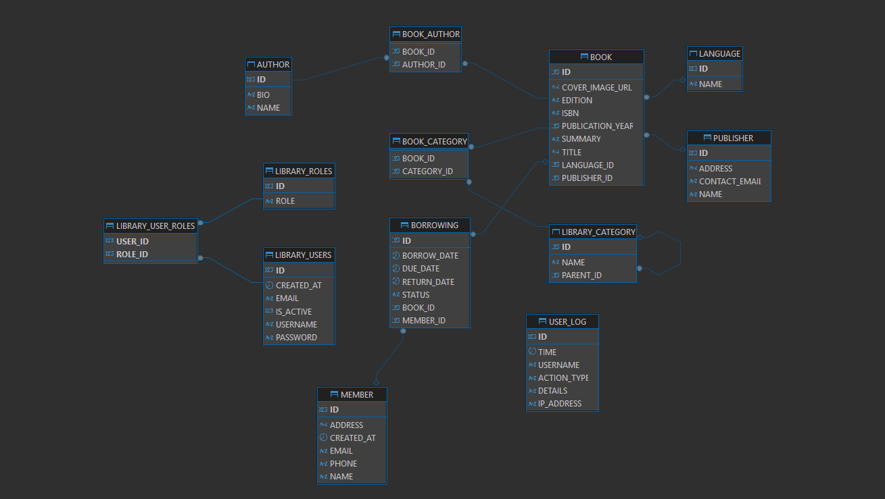

# Library Management System - CODE81 Backend Challenge

This project is a comprehensive, enterprise-grade Library Management System built with **Java** and the **Spring Boot** framework. It serves as a backend solution providing a robust **RESTful API** to manage books, members, borrowing transactions, and system users with role-based access control.

The system is designed following modern software architecture principles to be scalable, secure, and maintainable, fulfilling all the requirements of the CODE81 backend developer challenge.

---
[**postman Collections Link**](https://www.postman.com/galactic-eclipse-941788/workspace/public/collection/43180442-6d5baaeb-731c-46b8-92a2-2e3109a4df75?action=share&creator=43180442)
---

## ✨ Features

* **RESTful API**: Full CRUD (Create, Read, Update, Delete) operations for all major entities.
* **Role-Based Access Control (RBAC)**: Secure endpoints with granular permissions for different user roles (`ADMINISTRATOR`, `LIBRARIAN`, `STAFF`).
* **Authentication & Authorization**: Secure, token-based authentication using Spring Security and basic auth.
* **Advanced Book Management**: Handles books with rich metadata, including multiple authors, hierarchical categories, publishers, and cover images.
* **Transaction Management**: Functionality for borrowing and returning books, with status tracking (`BORROWED`, `RETURNED`, `OVERDUE`).
* **Internationalization (i18n)**: Support for multiple languages (English & Arabic) for API response messages.
* **User Activity Logging**: A custom logger to track significant user actions for auditing purposes.
* **Global Exception Handling**: A centralized mechanism to handle application errors gracefully and provide consistent JSON error responses.
* **API Documentation**: Integrated **Swagger UI** for easy exploration and testing of all API endpoints.

---

## 🛠️ Tech Stack & Dependencies

* **Framework**: Spring Boot 3.x
* **Language**: Java 17
* **Security**: Spring Security (basic Authentication)
* **Database**: OracleDB (or any other relational database)
* **Data Persistence**: Spring Data JPA / Hibernate
* **API Documentation**: Springdoc OpenAPI (Swagger 3)
* **Mapping**: MapStruct for efficient DTO-Entity mapping
* **Utilities**: Lombok to reduce boilerplate code
* **Build Tool**: Maven
*  **Containerization**: Docker

---

## 🏛️ Architecture & Design Choices

The application is built using a classic **Layered Architecture** to ensure separation of concerns and maintainability.

1. **Controller Layer (`controller` package)**: Exposes the RESTful API endpoints. It's responsible for handling HTTP requests, validating input (via DTOs), and delegating business logic to the service layer.

2. **Service Layer (`service` package)**: Contains the core business logic. It orchestrates calls to the repository layer and implements the main functionalities of the application, like creating a user or borrowing a book.

3. **Repository Layer (`repository` package)**: Responsible for data access. It uses Spring Data JPA interfaces to interact with the database, abstracting away the boilerplate code for CRUD operations.

4. **DTO Pattern (`dto` package)**: I've used Data Transfer Objects (DTOs) extensively to decouple the API interface from the internal database entities. This provides several benefits:
   * **Security**: Prevents sensitive entity fields from being exposed in API responses.
   * **API Stability**: The API contract (DTOs) can remain stable even if the internal domain model (`entity`) changes.
   * **Flexibility**: Allows for custom request/response structures tailored to specific use cases (e.g., `BorrowingRequestDto` vs. `BorrowingResponseDto`).

5. **Centralized Exception Handling (`exception` package)**: A `@ControllerAdvice` class intercepts exceptions thrown from any layer and maps them to a standardized `ErrorResponse` DTO, ensuring consistent error handling across the API.

6. **Data Initialization (`dataInitializer` package)**: On application startup, `CommandLineRunner` beans are used to seed the database with essential data like user roles (`ADMINISTRATOR`, `LIBRARIAN`, `STAFF`) and supported languages, ensuring the system is ready to use immediately.

---

## 🔑 Security

* **Authorization**:
  * API endpoints are secured based on user roles. The system defines three primary roles:
    * `ADMINISTRATOR`: Has full access to all APIs, including system user management.
    * `LIBRARIAN`: Can manage books, authors, categories, publishers, and borrowing transactions.
    * `STAFF`: Has limited access, primarily for viewing data and managing members.
  * Endpoint security is configured declaratively in the `SecurityConfig` class.

* **Password Storage**: User passwords are securely stored in the database after being hashed using the `BCryptPasswordEncoder`.

---


##  🏗️ Project Structure
```
Library-system/
├── src/
│   ├── main/java/com/librarysystem/
│   │   │   ├── config/         # 🛠️ Spring configuration classes
│   │   │   ├── controller/     # 🎮 REST controllers
│   │   │   ├── constants/      # ❗ constants values
│   │   │   ├── dataInitializer/  # 📦 Language and roles intilize
│   │   │   ├── dto/            # 📦 Data Transfer Objects
│   │   │   ├── exception/      # ❗ Exception handling
│   │   │   ├── entity/          # 🗃️ Entity classes
│   │   │   ├── repository/     # 💾 JPA repositories
│   │   │   ├── mapper/         # 🔒  mapStruct classes
│   │   │   └── service/        # 💡 Business logic
│   │   └── resources/
│   │       ├── i18n            # ⚙️ bundleMessages in Arabic and English
│   │       ├── application.yml # ⚙️ Configuration
│   │       └── static/         # 🖼️ Static resources
│   └── pom.xml                 # 📦 Maven dependencies
├── sql_samples/                 # 🖼️sql scripts
├── ERD.png                     # 🖼️ ERD Diagram
├── swagger_UI)images/          # 🖼️ Screenshots & images   
└── README.md                   # 📖 This file
```

---

## 📄 Database Schema (ERD)

An Entity-Relationship Diagram (ERD) is included below to visually represent the database schema and the relationships between entities such as `Book`, `Author`, `Category`, `Member`, and `User`.

**Key Relationships**:
* `Book` & `Author`: Many-to-Many
* `Book` & `Category`: Many-to-One (supporting hierarchical structure via a self-referencing `parent` field in `Category`)
* `Book` & `Publisher`: Many-to-One
* `Borrowing` & `Book`: Many-to-One
* `Borrowing` & `Member`: Many-to-One
* `user` & `role`: Many-to-Many


---

## ⚙️ Getting Started

Follow these steps to get the application up and running locally.

### Prerequisites

* JDK 17 or later
* Apache Maven
* OracleDb (or another relational database)

### 1. Clone the Repository

```bash
git clone https://github.com/AbdurahmanHussien/Library-Management-System.git
cd library-management-system
```

### 2. Configure the Database

1. Create a new database in Oracle (e.g., `library_db`).
2. Open the `src/main/resources/application.yml` file.
3. Update the database connection properties:

```properties
spring:
  config:
    activate:
      on-profile: default
  datasource:
    url: jdbc:oracle:thin:@//localhost:1523/pdb
    username: your_username
    password: your_password
    driver-class-name: oracle.jdbc.OracleDriver
```

### 3. Run the Application 
## 3.1. Locally

You can run the application using the Spring Boot Maven plugin:

```bash
mvn spring-boot:run
```

The application will start on port `9090`.


## 3.2. Docker

1. **Build and Start Containers**

   ```bash
   docker-compose up --build
   ```

   This command starts:

   * Oracle database container
   * Spring Boot application container

2. **Database Configuration**

   * **Host**: `localhost`
   * **Port**: `1521`
   * **SID**: `XEPDB1` (or your configured PDB)
   * **Username**: `your_user`
   * **Password**: `your_password`

3. **Spring Boot Connection**
   `application.yml` included database Connection enabled with docker profile

4. **Useful Commands**

   * Restart: `docker-compose restart`
   * Stop: `docker-compose down`
   * Logs: `docker-compose logs -f`

The setup aims to simplify local development and testing by providing a consistent runtime environment.

---


### 4. Sample Data

SQL scripts with sample data are provided in the `/sql_sample` directory. You can run these scripts against your database to populate it with initial data for books, members, and users, making it easier to test the application.

---

## 🚀 API Documentation

### Swagger UI

Once the application is running, you can access the interactive Swagger UI to explore, test, and view the documentation for all API endpoints.

**Swagger URL**: `http://localhost:9090/swagger-ui/index.html`

### Postman Collection (Bonus)

A Postman collection is included in the repository (`swagger_ui_images/CODE81_Library_API.postman_collection.json`). You can import this collection into Postman for a streamlined API testing experience. It includes pre-configured requests for all major endpoints.


